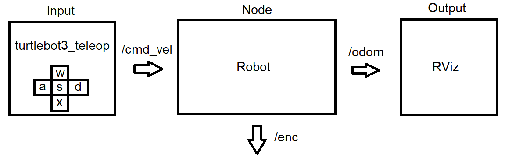

# ROS-HW

Пакет разработан в рамках [домашнего задания](https://github.com/McGorky/ros-hw) студентами группы КРБО-01-20 Бурлаком А. А. и Катковым Г. И.

ОC: *Ubuntu 20.04*

ROS: *ros-noetic 1.16.0*

## Суть

В соответсвии с заданием написан узел, моделирующий поведение робота с дифференциальным управлением. Управление роботом осуществляется с помощью пакета [turtlebot3_teleop](http://wiki.ros.org/turtlebot3_teleop), который преобразует сигналы с клавиш WASDX клавиатуры в управляющие команды. Узел работает с 3 топиками:
 1. **/cmd_vel** - из этого топика узел получает управляющие команды в формате geometry_msgs/Twist
 3. **/enc** - в этот топик узел публикует значения на энкодерах левого и правого колёс в пользовательском формате сообщений [Encoders.msg](beginner_tutorials/msg/Encoders.msg)
 4. **/odom** - в этот топик узел публикует положение и скорость робота в формате nav_msgs/Odometry
 


Сообщения из топика **/odom** могут быть использованы для визуализации в RViz. Открыв одновременно терминал с turtlebot3_teleop и RViz, можно управлять роботом, как машинкой на пульте управления.


## Структура узла

Рассмотрим файл [robot.py](beginner_tutorials/src/robot.py).

### main()

```python
if __name__ == '__main__':
    rospy.init_node("Robot")
    rate = rospy.Rate(10) # 10hz
    com = Commander()
    while not rospy.is_shutdown():
        com.publish_enc()
        com.publish_odom()
        rate.sleep()
```

### Commander

Класс Commander содержит методы publish_enc() и publish_odom() для публикации сообщений о состоянии робота с частотой 10 Гц, а также обрабатывает управляющие сообщения. Для симуляции моторов используется класс MotorModel, о нём далее.

```python
class Commander:
    def __init__(self):
        pub1_name = "/enc"
        pub2_name = "/odom"
        sub_name = "/cmd_vel"

        self.pub_enc = rospy.Publisher(pub1_name, Encoders, queue_size=10)
        self.pub_odom = rospy.Publisher(pub2_name, Odometry, queue_size=10)
        self.sub = rospy.Subscriber(sub_name, Twist, self.callback)
        self.pose = PoseWithCovariance()
        self.twist = TwistWithCovariance()
        self.left_motor = MotorModel()
        self.right_motor = MotorModel()
        self.rot = 0
```

### Commander.publish_enc()

Метод publish_enc() публикует сообщение типа Encoders в топик **/enc**

```python
    def publish_enc(self):
        header = Header(stamp=rospy.Time.now(), 
                        frame_id="enc")
        msg = Encoders(header=header, 
                       left=self.left_motor.enc, 
                       right=self.right_motor.enc)

        self.pub_enc.publish(msg)
        rospy.loginfo(msg)
```

### Commander.publish_odom()

Метод publish_odom() публикует сообщение типа Odometry в топик **/odom**

```python
    def publish_odom(self):
        header = Header(stamp=rospy.Time.now(), 
                        frame_id="odom")
        msg = Odometry(header=header, 
                       child_frame_id="odom", 
                       pose=self.pose, 
                       twist=self.twist)

        self.pub_odom.publish(msg)
        rospy.loginfo(msg)
```

### Commander.callback()

Когда узел получает сообщение с командой в формате geometry_msgs/Twist в топике **/cmd_vel**, вызывается функция callback(), которая записывает полученные команды и вызывает обновление модели.

```python
    def callback(self, msg):
        rospy.loginfo("Received a /cmd_vel message!")
        rospy.loginfo("Linear Component: [%f]"%(msg.linear.x))
        rospy.loginfo("Angular Component: [%f]"%(msg.angular.z))
        self.update(msg)
```

### Commander.update()

Ну и самое главное - функция update(). Получив сообщение, содержащие целевые значения линейной и угловой скоростей робота, функция вычисляет целевые значения угловых скоростей колёс. Затем эти скорости передаются в модели правого и левого колёс. Каждое колёсо описывается апериодическим звеном. Метод step() у моделей колёс возвращает их текущую угловую скорость и dt с момента последнего вызова. На основе текущих скоростей true_wl и true_wr вычисляются истинные скорости - линейная V и угловая Omega. Путём интегрирования скоростей происходит определение координат x, y робота в пространстве, а также азимута rot. Так как формат nav_msgs/Odometry подразумевает ориентацию робота в виде кватерниона, то в конце происходит преобразование азимута в кватернион и запись всех вычисленных величин в формат, готовый к выводу.

```python
    def update(self, msg):
        L = 0.287
        r = 0.033

        V = msg.linear.x
        Omega = msg.angular.z
        wl = (V - .5*Omega*L)/r
        wr = (V + .5*Omega*L)/r

        true_wl, dt = self.left_motor.step(wl)
        true_wr, dt = self.right_motor.step(wr)

        V = .5*r * (true_wl + true_wr)
        Omega = r/L * (true_wr - true_wl)
        self.rot += Omega*dt

        x = V * cos(self.rot) * dt
        self.pose.pose.position.x += x

        y = V * sin(self.rot) * dt
        self.pose.pose.position.y += y

        q = quaternion_from_euler(0, 0, self.rot)
        self.pose.pose.orientation.x = q[0]
        self.pose.pose.orientation.y = q[1]
        self.pose.pose.orientation.z = q[2]
        self.pose.pose.orientation.w = q[3]

        self.twist.twist.linear.x = V * cos(self.rot)
        self.twist.twist.linear.y = V * sin(self.rot)
        self.twist.twist.angular.z = self.rot
```

### MotorModel

Как уже было сказано выше, моторы робота симулируются апериодическим звеном. Каждый экземпляр содержит следующие поля: модель системы sys, текущее состояние x, время последнего шага t, текущую целевую скорость w_target, а также показание энкодера enc.

```python
class MotorModel:
    def __init__(self):
        k = 1
        T = 1
        W = control.tf(k, [T, 1])
        self.sys = control.LinearIOSystem(W)
        self.x = [[0, 0]]
        self.t = rospy.get_time()
        self.w_target = 0
        self.enc = 0
```

### MotorModel.step()

Данный метод моделирует поведение САУ. На выходе САУ имеем текущую угловую скорость, а также новое состояние системы. Зная время, прошедшее с последнего шага и угловую скорость, вычисляет количество импульсов энкодера. По нему метод определяет истинную скорость вращения колеса. На заключительном этапе происходит запись показаний энкодера, времени и целевой угловой скорости для использования на следующем шаге. Метод возвращает истинную угловую скорость и dt, которое понадобится для интегрирования при вычислении одометрии.

```python
    def step(self, w_target):
        t = rospy.get_time()
        a, w, self.x = control.input_output_response(self.sys, [self.t, t], [self.w_target, w_target], self.x[0][1], return_x=True)
        dt = t - self.t
        d_enc = int(w[1] * dt / 2 / 3.1415926535 * 4096)

        true_w = d_enc * 2 * 3.1415926535 / dt / 4096

        self.enc += d_enc
        self.t = t
        self.w_target = w_target
        return true_w, dt
```

## Как запустить

Краткая инструкция.

**Внимание!**

Пакет написан для

ОC: *Ubuntu 20.04*

ROS: *ros-noetic 1.16.0*

### Загрузка пакетов

Клонировать этот репозиторий, а также [turtlebot3_teleop](http://wiki.ros.org/turtlebot3_teleop) в catkin_ws/src.

```linux
$ cd ~/catkin_ws/src
$ git clone https://github.com/ROBOTIS-GIT/turtlebot3
$ git clone https://github.com/n04ka/ros-hw
```

### Ядро

Запустить ядро ROS

```linux
$ roscore
```

В терминале появится информация о запуске ядра

### Узел

В новом терминале сделать source

```linux
$ cd ~/catkin_ws
$ source ./devel/setup.bash
```

Выполнить catkin_make

```linux
$ catkin_make
```

Не стоит переживать если на этом этапе в терминале будет красное сообщение об ошибке, узел запустится и с ним, главное, чтобы robot.py был исполняемым:

```linux
$ rosrun beginner_tutorials robot.py
```

Если всё сделано правильно, то в терминале начнут появляться сообщения узла

### Управляющий узел turtlebot

В новом терминале запустить turtlebot. Из него будет происходить управление роботом на клавиши WASDX.

```linux
export TURTLEBOT3_MODEL=waffle; roslaunch turtlebot3_teleop  turtlebot3_teleop_key.launch
```

### Визуализация

Запуск RViz осуществляется командой в новом терминале

```linux
$ rosrun rviz rviz
```


В открывшемся окне необходимо добавить инструмент Odometry и привязать его к топику /odom. В Global Options -> Fixed Frame установить odom. Чтобы стрелка на экране не клонировалась, можно установить параметр Keep в 1, тогда отрисовываться будет только самое последнее положение робота.

### Готово

В итоге должно быть 4 открытых терминала:
1. Ядро ROS
2. Управление turtlebot
3. Узел Robot
4. RViz

Управление:
+ W - увеличить V
+ X - уменьшить V
+ A - увеличить w
+ D - уменьшить w
+ S - остановка

*Бурлак А. А. Катков Г. И.*


